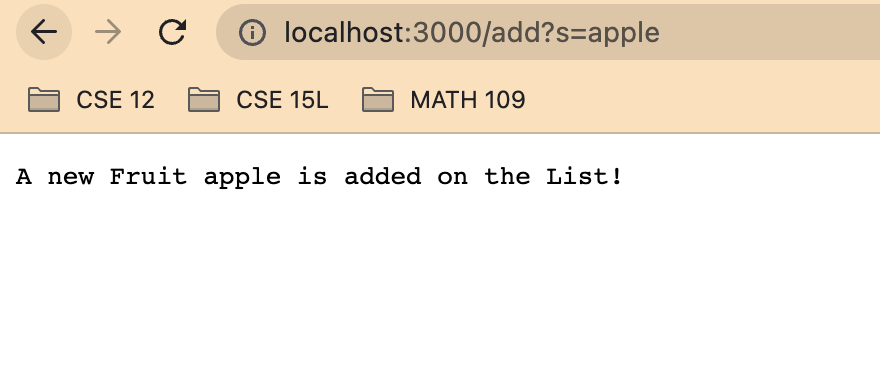

**Lab Report 2 – Servers and Bugs**

**-PartA**<br>
SearchEngine.java 
```
import java.io.IOException;
import java.net.URI;
import java.util.ArrayList;
import java.util.Arrays;

class Handler implements URLHandler {
    // The one bit of state on the server: a number that will be manipulated by
    // various requests.
    ArrayList<String> FruitsList =  new ArrayList<>(Arrays.asList("Strawberry"));

    public String handleRequest(URI url) {
        if (url.getPath().equals("/")) {
            return String.format("I have Fruit %s", FruitsList.get(0));
        } 
        
         else if(url.getPath().contains("/add")){
            System.out.println("Path: " + url.getPath());
            
                String[] parameters = url.getQuery().split("=");
                if (parameters[0].equals("s")) {
                   
                 FruitsList.add(parameters[1]);
                    
                  
                }   return String.format("A new Fruit %s is added on the List!", parameters[1]);
            }

            else if (url.getPath().contains("/search")) {
                String[] parameters = url.getQuery().split("=");
                if (parameters[0].equals("s")) {
                   
                 if(parameters[1].equals("app")){
            
                    String[] changenewString = new String[FruitsList.size()];
                         for(int i =0; i < FruitsList.size(); i++) {
                            changenewString[i]= FruitsList.get(i);
                         }
                         
                        return String.format("Now, We have %s in the list",Arrays.toString(changenewString));
                    
                         
                        }
                 }
                    
                  
                }   

            
          

            return "404 Not Found!";
        
    }
}  

class SearchEngine {
    public static void main(String[] args) throws IOException {
        if(args.length == 0){
            System.out.println("Missing port number! Try any number between 1024 to 49151");
            return;
        }

        int port = Integer.parseInt(args[0]);

        Server.start(port, new Handler());
    }
}

```
**First**, this is my URL Browser. The list have Strawberry.

This method is used. 
```
public String handleRequest(URI url) {
        if (url.getPath().equals("/")) {
            return String.format("I have Fruit %s", FruitsList.get(0));
        } 
        
```
Also, as I add strawberry in the list when made a Arraylist in the class, 
```
 ArrayList<String> FruitsList =  new ArrayList<>(Arrays.asList("Strawberry"));
 ```
 
 So the website prints "I have Fruit Strawberry".


**Second**, I add an apple in the list. I put 
**/add?=apple**. 



This method  
```
public String handleRequest(URI url)
```
 is used.
 In this method, else if statement is used. 
```
 else if(url.getPath().contains("/add")){
            System.out.println("Path: " + url.getPath());
            
                String[] parameters = url.getQuery().split("=");
                if (parameters[0].equals("s")) {
                   
                 FruitsList.add(parameters[1]);
                    
                  
                }   return String.format("A new Fruit %s is added on the List!", parameters[1]);
            }
```
when the path contains **/add**, it runs the else if statement. A string after s, will be a next parameters[1].

For example, when I put grape which is the third step, it will add a grape in the list. 

Third, I add a grape in the list. I put 
**/add?=grape**

As I explained, a string after s which is equal to s, become a next parameters[1]. In this case, grape become a parameters[1], so it will print "A new Fruit grape is added on the List!".

Last, I printed my list of fruit. I put
**/search?s=app**

A method I used is this. 
```
public String handleRequest(URI url)
```
In this method, this path will path else if statement. 
```
else if (url.getPath().contains("/search")) {
                String[] parameters = url.getQuery().split("=");
                if (parameters[0].equals("s")) {
                   
                 if(parameters[1].equals("app")){
            
                    String[] changenewString = new String[FruitsList.size()];
                         for(int i =0; i < FruitsList.size(); i++) {
                            changenewString[i]= FruitsList.get(i);
                         }
                         
                        return String.format("Now, We have %s in the list",Arrays.toString(changenewString));
                    
                         
                        }
                 }
                    
                  
                }   
```
When ths path contains /search and s = app, it should print Array. Array list is changed to Array to return all the array. 
```
 if(parameters[1].equals("app")
```
because I said if it is s =app, if any other string that is not app, it will not return the array. 
For example, if http://</span>localhost:3000/search?s=apps,
it will be like this.


If the path does not satisfy any statement(if,ifelse,else)
```
  return "404 Not Found!";
```


**-PartB**
<br> 1. ```static void reverseInPlace(int[] arr)```<br>
I wrote test like this:
 ```
public void testReverseInPlace() {
    int[] input1 = { 3,5 };
    ArrayExamples.reverseInPlace(input1);
    assertArrayEquals(new int[]{ 5,3} , input1);
	}
```
The Symptom: 

The Bug:
```
arr[i] = arr[arr.length - i - 1];
```
When the void changes the array order, it removes the original element. 

Fix:
 To fix the error, we need to make a new array and save the original array. After reversing the array in the new array, we need to copy the new array to the original array. 
```
static void reverseInPlace(int[] arr) {
      
      int tempNewArray[] = new int[arr.length];
  
      for(int i =0; i < arr.length; i++) {
        tempNewArray[i] = arr[i];
      }
  
  
      for(int i = 0; i < arr.length; i++) {
       tempNewArray[i] = arr[arr.length-1-i];
  
      }
      for(int i =0; i < arr.length; i++) {
        arr[i]=tempNewArray[i];
      }
    }
```
In the new fixed code, I made tempNewArray[i] and save the reverse array. After reversing the array, 
I copied tempNewArray to arr. 
```
arr[i]=tempNewArray[i]
```

2. ```static List<String> filter(List<String> list, StringChecker sc)``` <br>
I wrote test like this:
```

    public class ListTests {
    @Test
    public void testFilter(){
    
        ListLengthChecker lengthChecker = new ListLengthChecker();
        lengthChecker.holdshortLength("gabber");
        List<String> newstringlist = new ArrayList<>();
        newstringlist.add("Supercalifragilisticexpialidocious");
        newstringlist.add("handkerchief");
        newstringlist.add("abbreviations");
        newstringlist.add("Ant");
        List<String> comparestringlist = new ArrayList<>();
        comparestringlist.add("Supercalifragilisticexpialidocious");
        comparestringlist.add("handkerchief");
        comparestringlist.add("abbreviations");
        assertArrayEquals(comparestringlist.toArray(),ListExamples.filter(newstringlist,lengthChecker).toArray());

        


    }
}


```
Also, I created a new class.


The Symtom:


The Bug:
```
if(sc.checkString(s)) {
        result.add(0, s);
      }
    
```
A new add value is added on the first place in the arraylist. 
So when the new arraylist is created, a new value will be always place in the first place in the arraylist.

Fix:
```
if(sc.checkString(s)) {
        result.add(result.size(), s);
      }
      
```


-> checkstring return true if if the string length is longer than "gabber" . If the length is longer than "gabber", checkstring returns true and add a new string in the end of a **result** array list. 
As "Supercalifragilisticexpialidocious", "handkerchief", "abbreviations" are longer than gabber, so those three string are added on the result arraylist on the end. But, as "Ant" is shorter than gabber, it does not add to a result arraylist.
So result  will be 
**"Supercalifragilisticexpialidocious",  "handkerchief", "abbreviations",** which is equal to comaparestringlist. 

