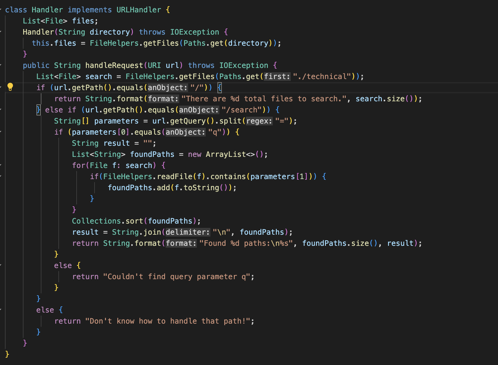
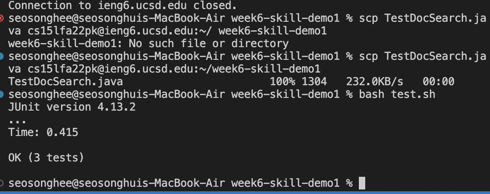
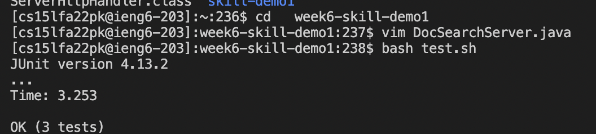

**Week 7 Lab Report**<br>


**-Part 1**

I choosed to change the name of the **start** parameter in getFiles, and all of it uses to call as **base**. 

I used this following vim commands.
```
:%s/start/base/gc<Enter>
```

**:s** is a substitute command. <br/>
**%** is a symbol that allow us to access all the contents in the file. <br/>
**/** is find and search command.<br/>
**gc** - g scans all lines in the range and c is a confirmation command.<br/>

As I used :%s, the computer is searching word "start" in the file, and try to replace to base. 

```
y<Enter>y<Enter>y<Enter>n<Enter>
```
As I did command c, the computer is asking for confirmation whenver the computer found word "start". I did 3 yes, and one no because computer was trying to change start parameter in class DocSearchServer.
```
:wq!\<Enter>
```
After changing the file, I used :wq! to save the changes and exit!

**Part 2**<br/>

Task: In DocSearchServer.java, find object name "paths" which type is list< File > in class Handler, and replace to "search". 

1. Using VSC and SCP

Using VSC, I change all the obect name paths and replace to search.

Then, I saved and scp TestDocSearch.java cs15lfa22pk@ieng6.ucsd.edu:~/week6-skill-demo1
Last, I used bash test.sh and it runned!

Totally, it took 5 minutes and 29 seconds. 


2. Using Vim in the remote server

In my remote server, I used vim to open and edit TestDocSearch.java

I used command <br/>
:%s/paths/search/gc to search word paths and replace to search. Since I only wanted to change paths object that is in class Handler, I did gc to confirm what I want to change. And then I exit using :wq!. Last, I used bash test.sh and it runned!

Totally, it took 3 minutes and 1 seconds. 


3. My Decision

Personally, I prefer to use vim when I need to work on remote programs. By using vim, I could directly edit the file and save it. As I directly edit I did not need to consider about what if I did not copy the file to the right directory. Also it took shorter than editing in VSC and copying to the remote server.

Usually, my decision is based on is it simple or not. As I can easily get an error if I put wrong one comma or blanck space, I prefer to write simple as I can. For example, when I used vsc, while copying to the remoter server directory, I got an error because I did write the exact directory name. This kind of error made time more longer than using VM. 