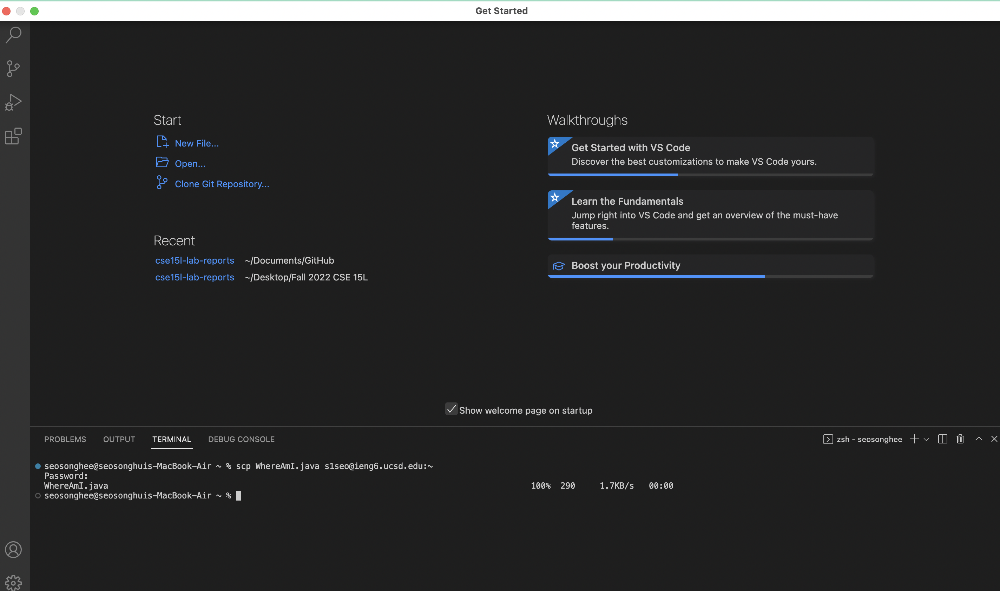

# Week 1 – Remote Access and the Filesystem
## 1.Installing VScode
Dowload Visual Studio Code through the
[Link](https://code.visualstudio.com)
After installing VS code, you will able to open VS code in your labtop.

## 2.Remotely Connecting
## 3.Trying Some Commands
## 4.Moving Files with scp
## 5.Setting an SSH Key
## 6.Optimizing Remote Running
