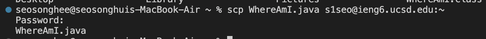
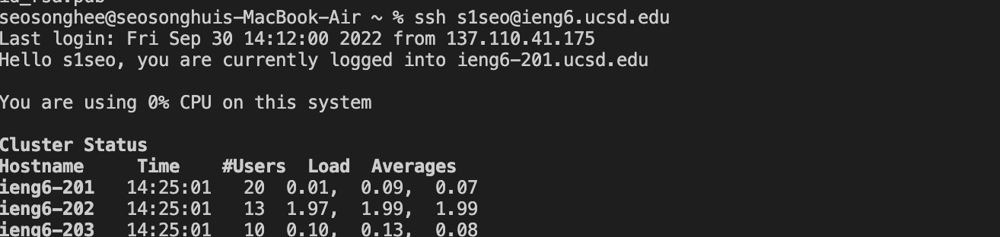
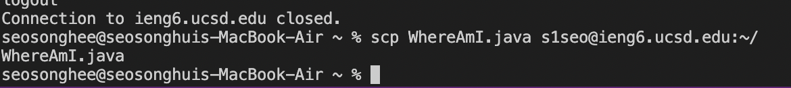
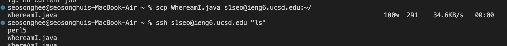

# Week 1 – Remote Access and the Filesystem
## 1.Installing VScode
Dowload Visual Studio Code through the
[Link](https://code.visualstudio.com)
After installing VS code, you will able to open VS code application in your labtop.

## 2.Remotely Connecting
Open Terminal in VS code. To login into other account we should use '**ssh**'.  
For example, if your course specific account is cs15lfa22zz@ieng6.ucsd.edu 
your command line shoule be -> ssh cs15lfa22zz@ieng6.ucsd.edu
For me, I tried to connect to my specific course account, but it faild like this. I recently, changed my password, so I might need to wait. 

So I connected to my school account using ssh. 
After logining into your account, you will see similar interaction like this:

## 3.Trying Some Commands
Use different type of commands like cd,cd~,ls -lat, ls -a, and pwd.
When I tried cd and cd ~ nothing happended. 
But when I tried ls -lat and ls -a, I could see all list of files.

 What did you see? 

## 4.Moving Files with scp
Now, lets copy files from one computer to another computer, using **scp**.

Before to start, lets log out to the remote server. Put '**exit**' command! How simple it is!

Create a file name **WhereAmI.java**  
Then lets compile the file
-> javac WhereAmI.java 
Lets run the file-> java WhereAmI

Then, the computer will list your directory of the file.

Next, we should copy **WhereAmI.java** file to other computer, using **scp** Your command should be like this:

In the Client server, we can see different user name, os, directory, and file name. 

## 5.Setting an SSH Key
Whenever, we use command **ssh** and **scp**, the computer requested to login each time. This is why we need SSH Key.

1. put **ssh -keygen** in the terminal,which will create public key and private key files. 

2. we need to copy the public key into the user directory(.ssh).
   
     Put
     **ssh** *youraccountid*. 
     After putting password, you will able to login to the account. 
     Then, put **mkdir.ssh** in the terminal. 
     Log out and put 
     **scp /Users/joe/.ssh/id_rsa.pub youracountid:~/.ssh/authorized_keys**

After setting an ssh key, you will able to use ssh and scp without putting password everytime like this!

## 6.Optimizing Remote Running

Through using different commands, users can access and remote other accounts. 

I used **ssh** and **scp** to access to my other account like this. 

