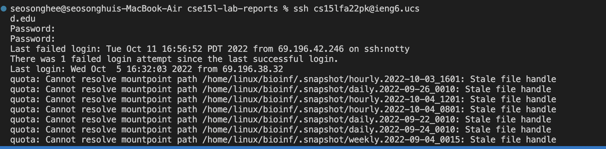

# Week 1 – Remote Access and the Filesystem
## 1.Installing VScode
Dowload Visual Studio Code through the
[Link](https://code.visualstudio.com).
After installing VS code, you will able to open VS code application in your labtop.

## 2.Remotely Connecting
Open Terminal in VS code. To login into other account we should use '**ssh**'.  
For example, if your course specific account is cs15lfa22zz<span>@ieng6.ucsd.edu<br/>
your command line shoule be<br/>-> ssh cs15lfa22z<span>@ieng6.ucsd.edu
After logining into your account, you will see similar interaction like this:


## 3.Trying Some Commands
Use different type of commands like cd,cd~,ls -lat, ls -a, and pwd.

-For cd and cd~: commands to go to the home directory. 
I tried cd and cd ~ nothing happended. Because I was already in the home directory.


But when I tried ls -lat and ls -a, I could see all list of files.
*ls-lat means to command all the files by the time order and it will be list long(detailed). 

*ls -a means to command all the files that starts with.


Lastly, I tried pwd, which displays the full path of the directory.


 What did you see? 

## 4.Moving Files with scp
Now, lets copy files from one computer to another computer, using **scp**.

Before to start, lets log out to the remote server. Put '**exit**' command! How simple it is!

Create a file name **WhereAmI.java** <br/>
In **WhereAm.I.java**, put the following code.

```

class WhereAmI {
  public static void main(String[] args) {
    System.out.println(System.getProperty("os.name"));
    System.out.println(System.getProperty("user.name"));
    System.out.println(System.getProperty("user.home"));
    System.out.println(System.getProperty("user.dir"));
  }
}
```

Then lets compile the file
-> javac WhereAmI.java<br/>
Lets run the file-> java WhereAmI

Then, the computer will list your directory of the file.
<br/>
Next, we should copy **WhereAmI.java** file to other computer, using **scp** Your command should be like this:

In the Client server, we can see different user name, os, directory, and file name. 

## 5.Setting an SSH Key
Whenever, we use command **ssh** and **scp**, the computer requested to login each time. This is why we need SSH Key.

1. Put **ssh -keygen** in the terminal, which will create public key and private key files. 

2. We need to copy the public key into the user directory(.ssh).
   
     1) Put **ssh** *youraccountid*.<br/>
     After putting password, you will able to login to the account.<br/>
     
     2) Put **mkdir.ssh** in the terminal.<br/>
      
     3) Log out and put<br/>
     scp/Users/seosonghee/.ssh/id_rsa.pub cs15lfa22pk<span>@ieng6.ucsd.edu:~/.ssh/authorized_keys

After setting an ssh key, you will able to use ssh and scp without putting password everytime like this!


## 6.Optimizing Remote Running

Through using different commands, users can access and remote other accounts. 

Command that we put in "", it can directly run the command that user put in the remoter server.

Also, ; can run many commands, in an one line. 

For example, if I want to compile and run the change in WhereAmI.java both in my server and also, in the remote server, I could use "" and ;. 

First, I add
```
System.out.println("Hello"); 
```
in WhereAmI.java.

This is the command that I used. 


->I used "" to compile and run the WhereAmI.java file in the remote computer. 
Also, i used ; to compile and run the file in one line to make it simple!
